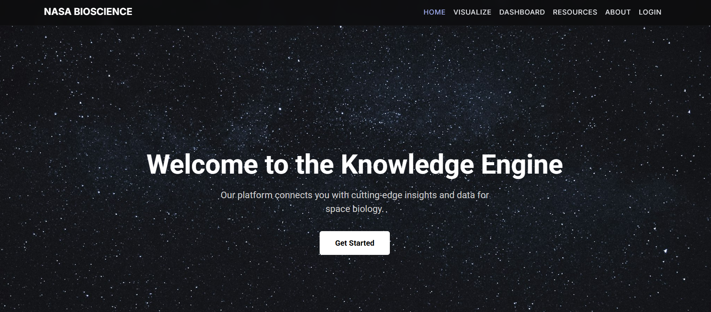
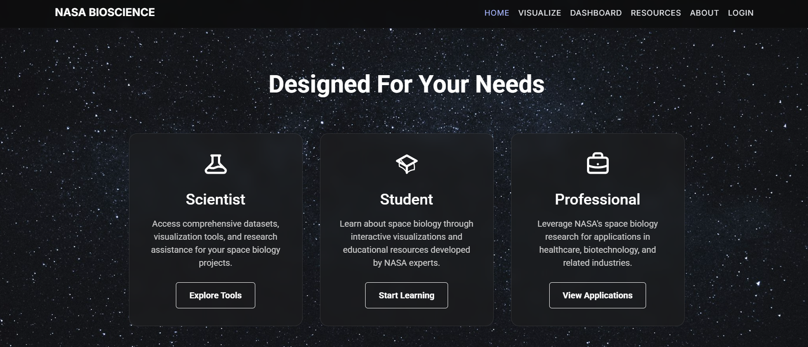
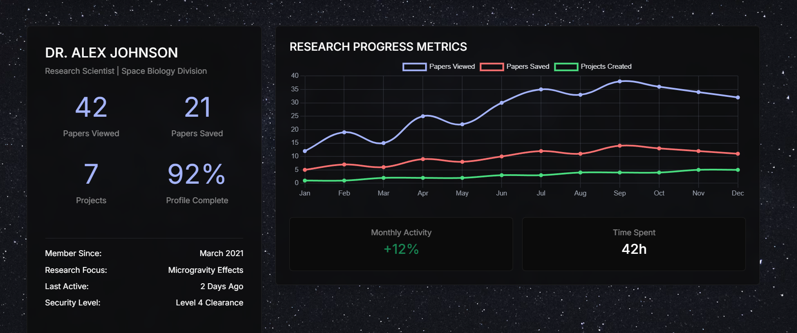
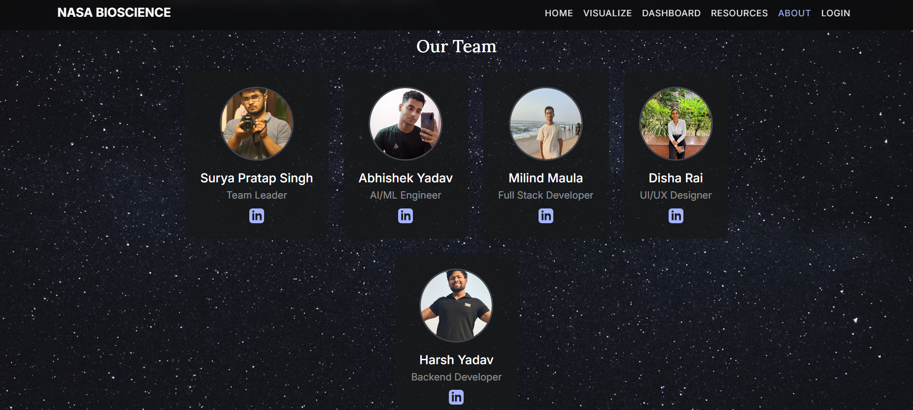

# 🚀 NASA Bioscience Knowledge Engine (Frontend)

This is the **frontend React app** for the NASA Space Apps Challenge 2025.  
It provides an interactive dashboard to explore NASA's space biology research data.


---

## 📦 Prerequisites

Before you begin, make sure you have installed:

- [Node.js](https://nodejs.org/) (includes `npm`)
- [Git](https://git-scm.com/)

Check versions:

```bash
node -v
npm -v
git --version
```

⚙️ Installation & Setup
1. Clone this repository

```bash
git clone https://github.com/AbhishekYadav65/nasa_space_challenge.git
cd nasa_space_challenge
```

2. Install dependencies

```bash
npm install
```

3. Start the development server

```bash
npm start
```

Now open your browser at:

👉 http://localhost:3000

The page will auto-reload when you make edits.


📂 Project Structure

```bash
nasa_space_challenge/
├── public/             # Static assets (HTML, manifest, robots.txt)
├── src/                # React source code
│   ├── pages/          # Page components
│   ├── photos/         # Images
│   ├── App.jsx         # Main React component
│   ├── index.css       # Global styles
│   └── index.js        # App entry point
├── package.json        # Project config + dependencies
└── README.md           # Project documentation
```

📚 Tech Stack

React.js – Frontend framework

React Router DOM – Page navigation

Chart.js – Interactive charts & graphs

Bootstrap – Styling & layout
---


## 📸 Previews

### Main Dashboard


### Research Analytics


### Track & Insights


### Team Overview

---


🚀 Future Integration

This frontend will connect to a backend (FastAPI/Flask) that:

Ingests NASA bioscience publications

Summarizes results using AI/ML

Provides semantic search

Visualizes knowledge graphs
